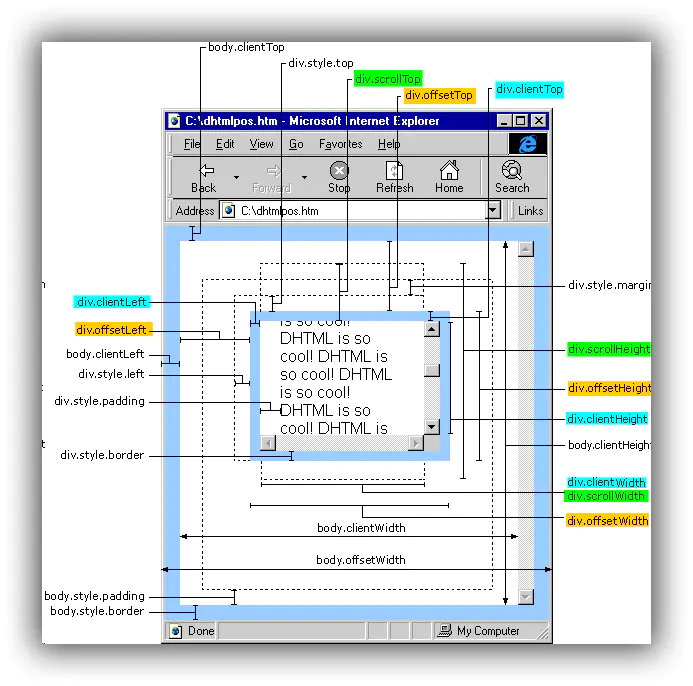
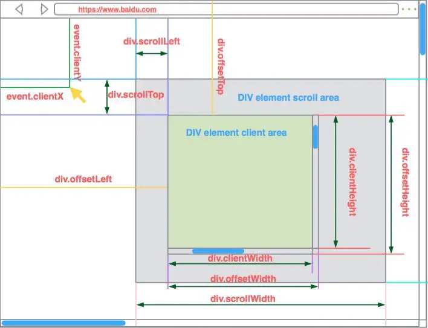
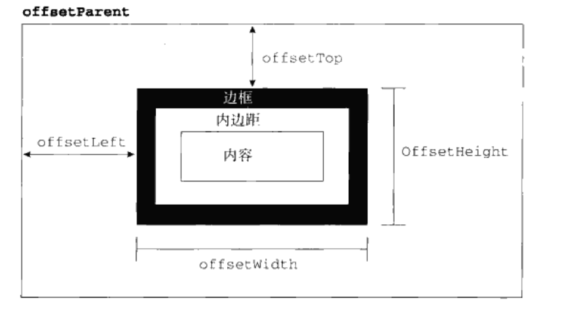
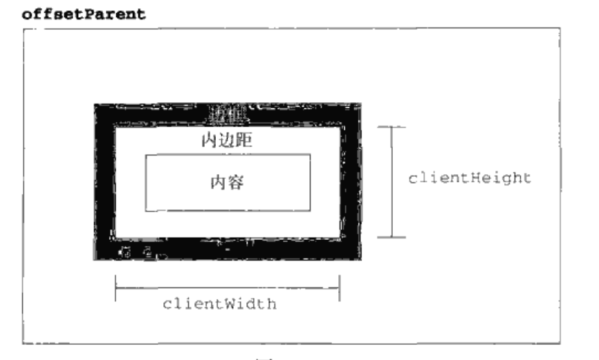
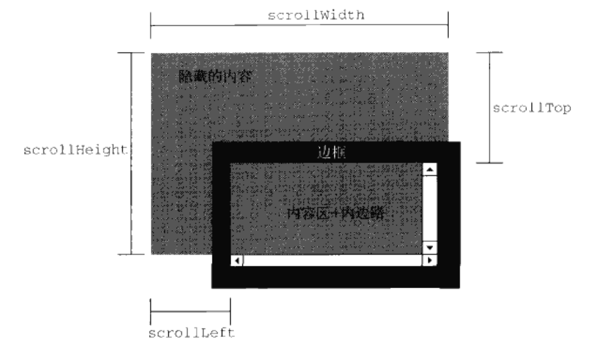

>本博客 [hjy-xh](https://hjy-xh.github.io/)，转载请申明出处

## 写在前面
在web前端开发中经常会碰到offset、client、scroll,容易混乱,这里记录一番.
先放两张图,未来好查阅 :smile:

## offset
offset: 偏移量
它包括元素在屏幕上占用的所有可见的空间.元素的可见大小由其高度、宽度决定,包括所有的内边距`padding`,滚动条和边框`border`大小(注意:不包括外边距).

通过以下4个属性可以取得元素的偏移量:
- offsetHeight: offsetHeight = border-width * 2 + padding-top + padding-bottom + height
- offsetWidth: offsetWidth = border-width * 2 + padding-left + padding-right + width
- offsetLeft: offsetLeft = offsetParent 的padding-left + 中间元素的offsetWidth + 当前元素的margin-left
- offsetTop: offsetParent 的padding-top + 中间元素的offsetHeight + 当前元素的margin-top

**它们都是只读属性,每次访问都要重新计算,如果经常访问,可以用变量存起来,以提高性能**

## client
client: 客户区大小
它包括元素内容及其内边距所占据的空间大小.

通过以下2个属性可以取得元素的客户区:
- clientHeight: padding-top + padding-bottom + height
- clientWidth: padding-left + padding-right + width

**它们也是只读属性,每次访问都要重新计算**

## scroll
scroll: 滚动大小
它指的是滚动内容的元素的大小.
有些元素(比如`<html>`),即使没有执行任何代码也能自动地添加滚动条;有些元素需要通过设置CSS的`overflow`属性才能滚动.

通过以下4个属性可以取得滚动的相关属性:
- scrollHeight: 在没有滚动条的情况下,元素实际内容的总高度
- scrollWidth: 在没有滚动条的情况下,元素实际内容的总宽度
- scrollLeft: 被隐藏在内容区域左侧的像素数,设置该属性可以改变元素的滚动位置
- scrollTop: 被隐藏在内容区域上方的像素数,设置该属性可以改变元素的滚动位置

**通常认为`<html>`元素是在web浏览器的视口中滚动的元素,所以带有垂直滚动条的页面总高度就是`document.documentElement.scrollHeight`.**

