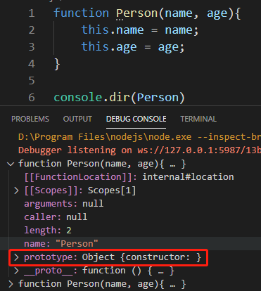
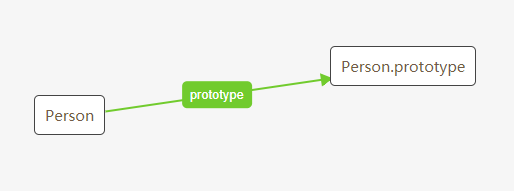
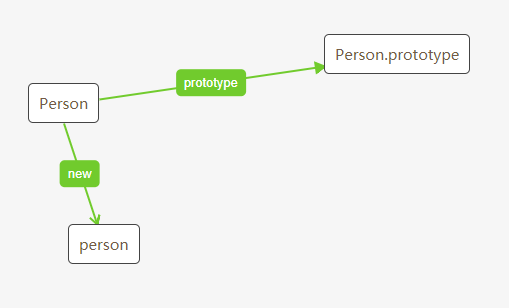
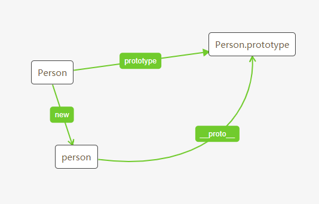
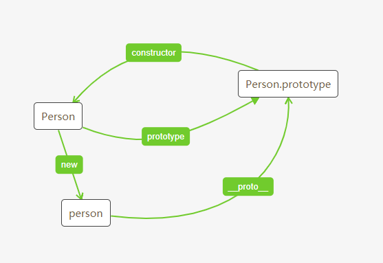
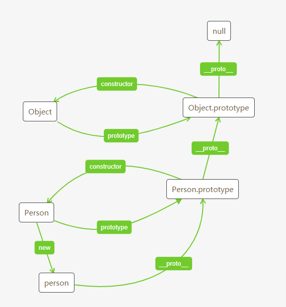

>本博客 [hjy-xh](https://hjy-xh.github.io/)，转载请申明出处

## Constructor 构造函数
先写一个构造函数Person(构造函数一般为了区别普通函数，要求首字母大写):
```javascript
function Person(name, age){
    this.name = name;
    this.age = age;
}
```

## prototype 原型
原型是一个对象，实例"继承"对象的属性.
也就是说在原型上定义的属性，通过"继承"这个行为，实例也拥有这个属性.该行为是在new关键字内部实现的.

我们把构造函数打印出来看看，发现其内部有一个名为prototype属性，通过它就能访问到原型:


Person 就是构造函数，Person.prototype 就是原型


## instance 实例
现在有构造函数了,我们可以在原型上创建可以被"继承"的属性,并通过new关键词创建实例


可以使用 instanceof 就是判断一个实例是否属于某种类型,现在创建一个实例:
```javascript
let person = new Person("小黄",22);
console.log(person instanceof Person);//true
```

如果我们在原型上定义一个属性后再实例化对象:
```javascript
function Person(name, age){
    this.name = name;
    this.age = age;
}
Person.prototype.eyeColor = "black"

let person = new Person("小黄",22);
console.log(person.eyeColor);//black
```

## proto 隐式原型
实例通过 __proto__ 访问到原型：


所以以下二者等价
```javascript
function Person(name, age){
    this.name = name;
    this.age = age;
}
Person.prototype.eyeColor = "black"

let person = new Person("小黄",22);
console.log(person.__proto__ === Person.prototype);//true
```

## constructor 构造函数(属性)
原型可以通过constructor访问到构造函数:
```javascript
function Person(name, age){
    this.name = name;
    this.age = age;
}

console.log(Person.prototype.constructor === Person);//true
```
继续完善关系图:

**注意这里的 constructor 是原型的一个属性，Constructor 指的才是真正的构造函数。两者名字不要弄混了**

## 原型链
原型同样也可以通过 __proto__ 访问到原型的原型,直到搜索到null:
```javascript
function Person(name, age){
    this.name = name;
    this.age = age;
}
Person.prototype.eyeColor = "black";

function People(){}
People.prototype = new Person();

let people = new People()
console.log(people instanceof Object)//true
console.log(people instanceof People)//true
console.log(people instanceof Person)//true
console.log(people.eyeColor)//black
console.log(people.__proto__)//Person {}
console.log(people.__proto__.__proto__)//Person {eyeColor: "black"}
console.log(people.__proto__.__proto__.__proto__)// {}
console.log(people.__proto__.__proto__.__proto__.__proto__)//null
```
由此可以得出原型、原型链、构造函数、实例、null之间的关系:


