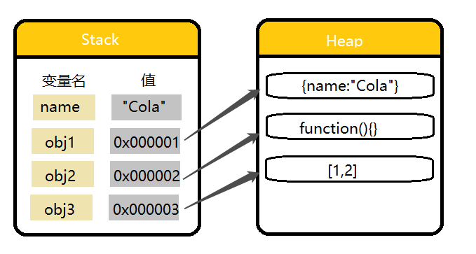

>本博客 [hjy-xh](https://hjy-xh.github.io/)，转载请申明出处


# 一.JavaScript数据类型
ECMAScript标准规定了7种数据类型，其把这7种数据类型又分为两种：原始类型和对象类型。
原始类型也叫基本数据类型，对象类型也叫引用数据类型。

#### 基本数据类型
- Null: 只包含一个值: **null**
- Undefined: 只包含一个值: **undefined**
- Boolean: 包含两个值: **true** 和 **false**
- Number: 整数或浮点数,还有一些特殊值: **-Infinity**、**+Infinity**、**NaN**
- String: 一串表示文本值的字符序列
- Symbol: 一种实例,是唯一且不可改变的数据类型

(在ES10中加入了第七种基本数据类型BigInt)

#### 引用数据类型
- Object: 除了常用的Object,还有Array,Function,Date,RegExp等也是特殊的对象

# 二.基本数据类型和引用数据类型的区别
#### 基本数据类型具有不可变性
在ECMAScript标准中，它们被定义为primitive values，即原始值，代表值本身是不可被改变的。

以字符串为例，我们在调用操作字符串的方法时，没有任何方法是可以直接改变字符串的：
```javascript
let name = "Cola";
name.slice(1);//ola
name.substr(2);//la
name.trim(1);//Cola
name.toLowerCase(1);//cola
name[1];//o
console.log(name);//Cola
```
可以看到对**name**字符串调用方法后再次打印它的值,**name**没有发生改变,由此可以得知字符串的不可变性.
而这些方法都是在原字符串的基础上产生新字符串.

接下来我们对字符串进行赋值操作:
```javascript
let name = "Cola";
name = "Coca " + name;
console.log(name);//Coca Cola
```
发现**name**的值"改变"了.这是为什么?
其实,**name**只是指向**"Cola"**的一个指针,指针的指向可以改变,所以**name = "Coca " + name;**执行后改变了**name**的指向,而**"Coca Cola"**这个原始值仍然不可改变.

#### 引用数据类型易变
引用类型的值实际存储在堆内存中,在栈中存储的是一个固定长度的地址,该地址指向堆内存中的值.
```javascript
let name = "Cola";
let obj1 = { name: "Cola" };
let obj2 = function () { };
let obj3 = [1, 2];
```


#### 基本数据类型的比较是值的比较,引用数据类型的比较是引用(地址)的比较
```javascript
let a = 1;
let a1 = 1;
let b = {};
let b1 = {};
console.log(a === a1);//true
console.log(b === b1);//false
```

#### 两种数据类型的复制区别
基本数据类型的复制:
```javascript
let name = "Cola";
let name2 = name;//此时内存开辟了一块新的空间用于存储Cola
name2="Coca Cola";
console.log(name);//Cola
console.log(name2);//Coca Cola
```

引用数据类型的复制:
```javascript
let obj={name:"Cola"};
let obj2 = obj;
obj2.name="Coca Cola";//实际上复制的是栈中存储的地址,因此obj和obj2指向的是同一个对象
console.log(obj.name);//Coca Cola
```

#### 特别注意:ECMAScript中所有的函数的参数都是按值传递的
值传递:
```javascript
let name = 'Cola';
function changeValue(name){
  name = 'Coca Cola';
}
changeValue(name);
console.log(name);//Cola
```
上面执行的结果是**Cola**,可见函数参数是按值传递的.

"引用传递":
```javascript
let obj = { name: "Cola" };
function changeValue(obj) {
    obj.name = 'Coca Cola';
}
changeValue(obj);
console.log(obj.name);//Coca Cola
```
这里彷佛违背了上面说的,其实没有.
当函数参数是引用类型时,Js同样将参数复制了一个副本到局部变量,只不过这个副本是指向堆内存中的地址,也就是在函数内部会对该对象的属性进行操作.

# 三.null和undefined的区别
先看看他们之间的关系:
```javascript
console.log(typeof null);//object
console.log(typeof undefined);//undefined
console.log(null == undefined);//true  二者都默认转换成false
console.log(null === undefined);//false 
```
- **null**表示没有对象,即此处不应该有值
	- 作为函数的参数时,表示该函数的参数不是对象
	- 作为对象原型链的终点
	
- **undefined**表示缺少值,即此处应该有值,但没有定义
	- 定义了形参,没有传实参,显示undefined
	- 访问对象的属性名不存在时,显示undefined
	- 函数没有返回值时,拿到的是undefined
	- 函数有返回值却没有赋值时,拿到的是undefined

**null** 和 **undefined** 转换成number数据类型时:
	- **null** 默认转成 **0**
	- **undefined** 默认转成 **NaN**

# 四.知识点很多的Number类型
- JavaScript 只有一种数字类型,即为Number，如 5 和 5.12 是相同的类型,也就是说,所有数字都是浮点数。

- JavaScript 使用“双精度64位格式IEEE 754”标准
- NaN: Not a Number,不是一个数,但它属于数值类型
	- NaN和任何值进行操作都会返回NaN
	- NaN与任何值都不相等,包括NaN本身
	
- isNaN(): 这是用于检测一个变量是不是**Number**类型的函数,它接收一个参数,参数可以是任何类型,该函数会尝试把传入的参数转换为数值,不能转换为数值的值返回true，能转换的返回false。
- 数值转换
	- Number()
	- parseInt() 取整
	- parseFloat() 浮点数

	##### Number()转换规则
	如果是布尔值，true和false会被转换为1和0。
```javascript
	Number(true) // 1
	Number(false) // 0
```
	如果是数字，没有特殊变换。
```javascript
	Number(1) // 1
	Number(100) // 100
```
	**null** 和 **undefined** 在上文提及

	如果是字符串
	- 字符串中只包含数字（包括前面带正/负号的情况），则将其转换为十进制数值,数字前面有0的会被忽略(不管前面有几个0，全部忽略)，例如"010"会转换成10。
```javascript
	Number("1") // 1
	Number("123") // 123
	Number("010") // 10 (前导的0会被忽略)
	Number("-10") // -10
```
	- 字符串中包含有效的浮点格式，如"1.1"，则将其转换为对应的浮点数值。
```javascript
	Number("1.1") // 1.1
	Number("0.1") // 0.1
	Number("0000.1") // 0.1 (前导的0会被忽略)
```
	- 字符串中包含有效的十六进制格式（一般用数字0到9和字母A到F（或a~f）表示，其中:A~F表示10~15，这些称作十六进制数字），如"0xf",将其转换成相同大小的十进制整数值。
```javascript
	Number(0xf) // 15
```
	- 字符串为空，转换成0。
```javascript
	Number("") // 0
```
	- 字符串中包含除了以上格式之外的字符，则转换为NaN，如字符串中既有数字又有字母的情况。
```javascript
	Number("Hello Wolrd") // NaN
	Number("0ff6600") // NaN
	Number("ff6600") // NaN
	Number("0.1a") // NaN
	Number("10a") // NaN
	Number("a10.1") // NaN
```

	##### parseInt(string,radix)
	这是一个将一个字符串转换成x进制整数的函数。

	传入的第一个参数为字符串，如果参数不是字符串，则将其转换为字符串(使用 ToString 抽象操作)。字符串开头的空白符将会被忽略。第二个参数为整数，表示按照xx进制转换，如传入参数10表示按十进制规则转换，

	从左到右依次查找有效数字字符，直到遇到非有效数字字符，停止查找（不管后面是否好友数字），把找到的当做数字返回。如果字符串中以0x开头且后跟数字字符，就会将其当做一个十六进制整数。
```javascript
	parseInt("123abc") // 123
	parseInt("") // NaN
	parseInt("12.5px") // 12
	parseInt("0xA") // 10 (16进制)
	parseInt("0xf") // 15 (16进制)
	parseInt("070") // 70
	parseInt("70") // 70
```

	##### parseInt(string,radix)
	解析一个参数（必要时先转换为字符串）并返回一个浮点数。默认解析十进制值。
```javascript
	function circumference(r) {
	  return parseFloat(r) * 2.0 * Math.PI;
	}
	console.log(circumference(4.567));// expected output: 28.695307297889173
	console.log(circumference('4.567abcdefgh'));// expected output: 28.695307297889173
```
	- 从左到右依次解析字符，一直解析到字符串末尾，遇到非数字字符会或遇到第二个浮点数（在这之前的字符串都会被解析）会使解析停止,如"3.14"解析成3.14，"3.14.1234"解析成3.14
	
	- 忽略参数首尾空白符
	- 十六进制格式的字符串始终会被转换成0
```javascript
	parseFloat("3.14") // 3.14
	parseFloat("-3.14") //-3.14
	parseFloat("+3.14") //3.14
	parseFloat("0003.14") // 3.14
	parseFloat(" 3.14 ") // 3.14
	parseFloat("3.14abc") // 3.14
	parseFloat("3.14.5678") // 3.14
	parseFloat("abc3.14") // NaN
	parseFloat("abc123") // NaN
	parseFloat("123abc") // 123
	parseFloat("0xA") //0
```
	
	#####parseInt() 和parseFloat() 的区别在于：
	parseFloat() 所解析的字符串中第一个小数点是有效的，而parseInt() 遇到小数点会停止解析。
