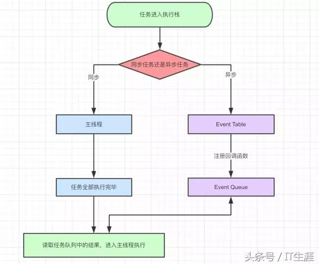
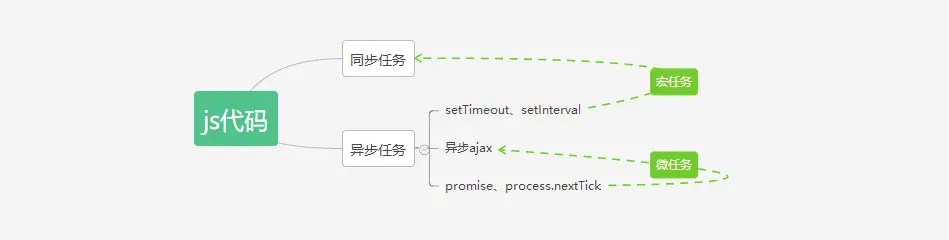
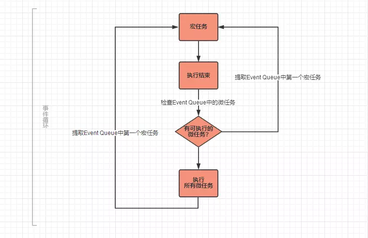
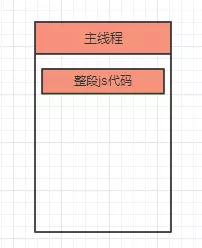
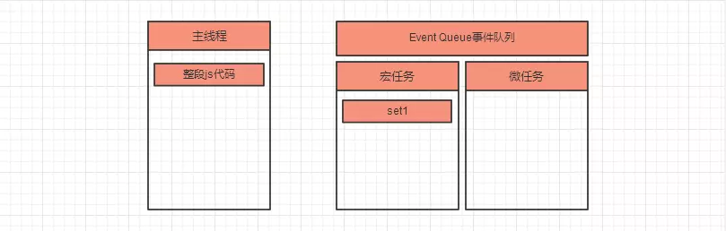
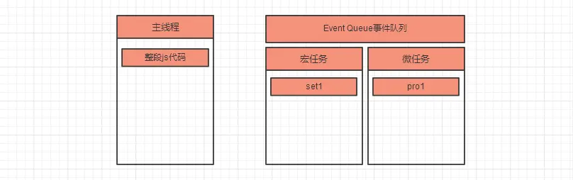
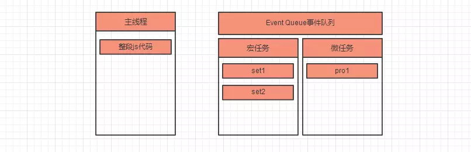
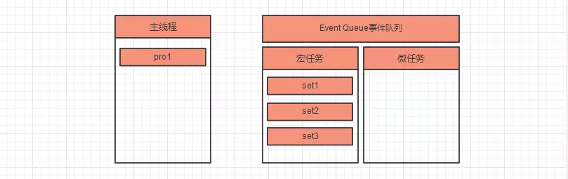
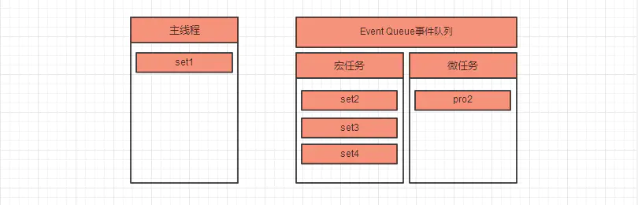
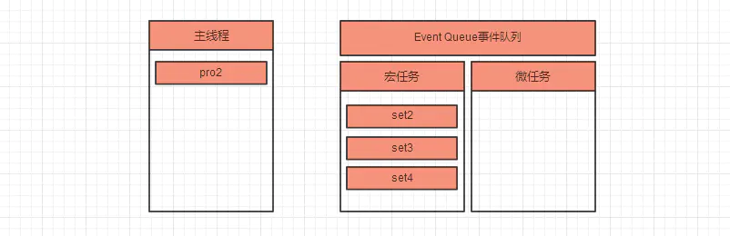

>本博客 [hjy-xh](https://hjy-xh.github.io/)，转载请申明出处

##JavaScript中的单线程
技术的出现总是和应用场景密切相关.
JavaScript诞生于1995年,主要用于处理表单验证操作,也就是实现用户和浏览器的交互.

由此带来一个思考:这门语言为什么是单线程?
作为浏览器脚本语言,JavaScript 的主要用途是与用户互动,以及操作 DOM.这决定了它只能是单线程,否则会带来很复杂的同步问题.比如,假定JavaScript同时有两个线程,一个线程在某个 DOM 节点上添加内容，另一个线程删除了这个节点，这时浏览器应该以哪个线程为准？
所以,**为了避免复杂性，从一诞生,JavaScript 就是单线程,这已经成了这门语言的核心特征,将来也不会改变.**

为了利用多核 CPU 的计算能力,HTML5 提出 **Web Worker 标准**,允许 JavaScript 脚本创建多个线程,但是子线程完全受主线程控制,且不得操作 DOM.所以,**这个新标准并没有改变 JavaScript 单线程的本质.**

那么单线程的特点就很明显了:
- 实现起来比较简单,执行环境相对单纯；
- 只要有一个任务耗时很长,后面的任务都必须排队等着,会拖延整个程序的执行.
(常见的浏览器无响应(假死),往往就是因为某一段Javascript代码长时间运行(比如死循),导致整个页面卡在这个地方,其他任务无法执行.)

## 同步和异步
在JS中,同步意味着在很多情况下CPU在等待:后一个任务等待前一个任务结束,然后再执行,程序的执行顺序与任务的排列顺序是一致的、同步的;也就是说当一件事情没有处理完成,JS会一直处理它,直至完成,才会开始下一件事情,这样可能会堵塞代码执行;

异步则是指每一个任务有一个或多个回调函数(callback),前一个任务结束后,不是执行后一个任务,而是执行回调函数,后一个任务则是不等前一个任务结束就执行,所以程序的执行顺序与任务的排列顺序是不一致的、异步的.

一句话概括就是:**同步等结果,异步不等结果.**

## JavaScript的执行机制
流程图如下:

注意点:
- JS代码分为同步任务和异步任务.
- 同步任务进入主线程执行,异步任务进入**Event Table(事件表)**,当事件表中的异步任务完成后会在**Event Queue(事件队列)**中注册回调函数.
- 主线程中的任务全部完成后,才会执行**Event Queue中**的任务.
- JS解析器会不断重复检查主线程执行栈是否为空,然后重复第3步,这称为**Event Loop(事件循环)**.

## 宏任务和微任务
JS代码的类型如下图所示:


宏任务主要有:
- script代码段
- setTimeout
- setInterval
- I/O

微任务主要有:
- process.nextTick
- Promise

注意点:
- 任务有**宏任务(Macro Task)**和**微任务(Micro Task)**之分,这对JS代码的执行有更细致的影响.
- 异步任务中的宏任务和微任务会进入不同的**Event Queue(事件队列)**,即**Event Queue**又可以分为宏任务队列和微任务队列.
- **setInterval**会按照设定的时间间隔重复地在**Event Queue**中注册回调函数,如果某一段时间主线程代码执行太久,那么**setInterval**的回调函数可能阻塞到一起执行,无法保持设定的时间间隔,如果此时**setInterval**用于动画,则体现为卡顿.

## 详细过程


通常来说,页面中JS的执行顺序是这样的:
- 第一轮事件循环:
	1.主线程执行JS整段(宏代码),将ajax、setTimeOut、promise等回调函数注册到**Event Queue**中,并区分宏任务和微任务.
	2.主线程提取并执行**Evene Queue**中的ajax、promise等所有微任务,并注册微任务中的异步任务到**Event Queue**(如果有).
- 第二轮事件循环:
	1.主线程提取并执行**Evene Queue**中的第一个宏任务,注册该任务中的异步任务到**Evene Queue**(如果有).
	2.执行**Evene Queue**中所有的微任务,并注册微任务中的异步任务到**Evene Queue**(如果有).
- 类似的循环:宏任务没执行完一个,就清空一次时间队列中的微任务.
注意点:**事件队列中分"宏任务队列"和"微任务队列"，每执行一次任务都可能注册新的宏任务或微任务到相应的任务队列中.**

## 例子
```javascript
console.log('1');

// 记作 set1
setTimeout(function () {
    console.log('2');
    // set4
    setTimeout(function() {
        console.log('3');
    });
    // pro2
    new Promise(function (resolve) {
        console.log('4');
        resolve();
    }).then(function () {
        console.log('5')
    })
})

// 记作 pro1
new Promise(function (resolve) {
    console.log('6');
    resolve();
}).then(function () {
    console.log('7');
    // set3
    setTimeout(function() {
        console.log('8');
    });
})

// 记作 set2
setTimeout(function () {
    console.log('9');
    // 记作 pro3
    new Promise(function (resolve) {
        console.log('10');
        resolve();
    }).then(function () {
        console.log('11');
    })
})

// 最终输出 : 1 6 7 2 4 5 9 10 11 8 3
```
- 第一轮事件循环:
	1.将整段script作为第一个宏任务进入主线程,遇到console.log,输出1.
	
	2.遇到set1,其回调函数被分发到宏任务**Event Queue**中.
	
	3.遇到pro1,new Promise直接执行,输出6.then被分发到微任务**Event Queue**中.
	
	4.遇到set2,其回调函数被分发到宏任务**Event Queue**中.
	
	5.主线程的整段JS代码(宏任务)执行完成,开始清空所有微任务;主线程执行微任务pro1,输出7;遇到set3，注册回调函数。
	

- 第二轮事件循环
	1.主线程执行队列中第一个宏任务set1,输出2;遇到set4,注册回调;再遇到pro2,new Promise直接执行,输出4,并注册回调.
	
	2.set1(宏任务)执行完,开始清空微任务,主线程执行微任务pro2,输出5;
	

- 第三轮事件循环
	1.主线程执行队列中第一个宏任务set2，输出9；代码中遇到了pro3，new promise()直接输出10，并注册回调；
	2.set2宏任务执行完毕，开始情况微任务，主线程执行微任务pro3，输出11。

- 类似循环...