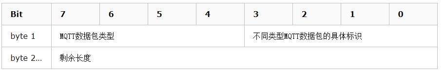
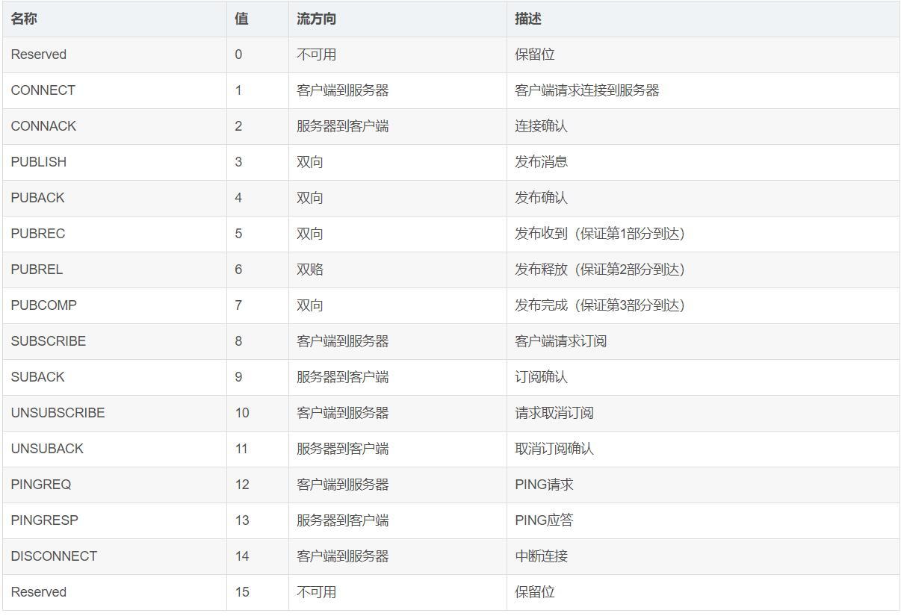
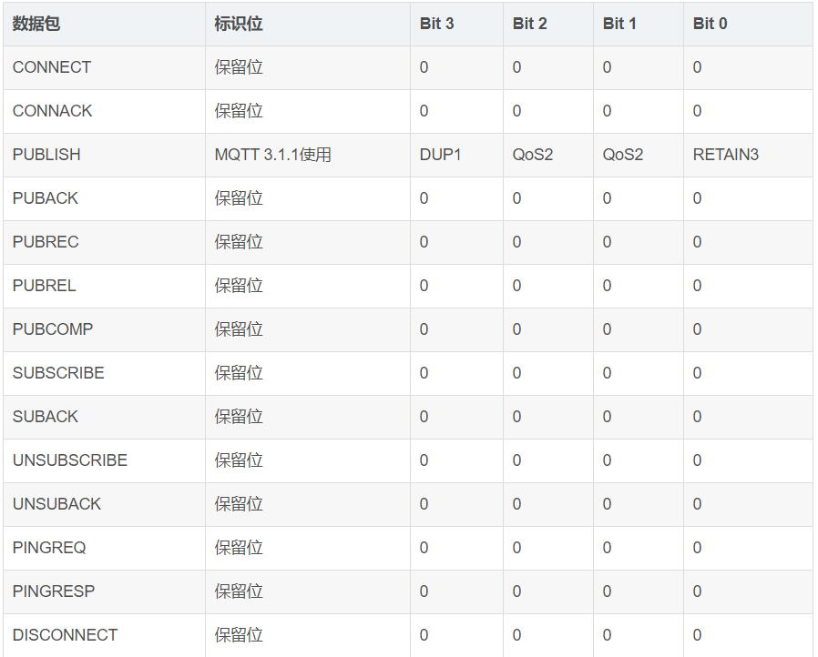
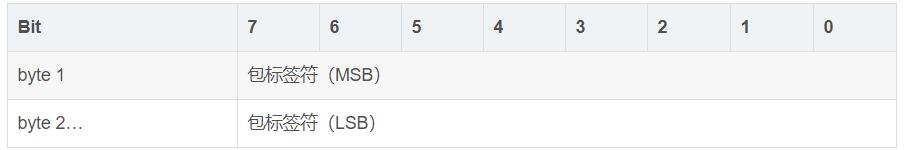

>本博客 [hjy-xh](https://hjy-xh.github.io/)，转载请申明出处

## 概述
MQTT(Message Queuing Telemetry Transport,消息队列遥测传输协议)，是一种基于发布/订阅(public/subscribe)模式的轻量级物联网消息推送协议。
该协议构建于TCP/IP协议上，是为硬件性能低下的远程设备以及网络状况糟糕的情况下而设计的协议。这让它成为新兴的"机器到机器（M2M)"，"物联网(IoT)"场景下的理想选择。

## 特点
- MQTT协议是轻量、简单、开放和易于实现的
- 提供服务质量管理
- 采用发布/订阅模式，方便消息传递
- 基于TCP/IP网络连接，提供有序，无损的双向连接
- 假如数据不可知，不强求传输数据的类型与格式，保持灵活性
- 1字节固定报头，2字节心跳报文，最小化传输开销和协议交换，有效减少网络流量

## 应用场景
MQTT协议广泛应用于物联网、移动互联网、智能硬件、车联网、电力能源等领域
- 物联网M2M通信，物联网大数据采集
- Android消息推送，Web消息推送
- 移动即时消息，例如Facebook Messenger
- 智能硬件、智能家居
- 车联网通信、电动车站桩采集
- 电力、石油与能源等行业市场

## 主题和负载
MQTT传输的消息分为：主题（Topic）和负载（payload）
- Topic：可以理解为消息的类型，订阅者订阅（Subscribe)后，就会收到该主题的消息内容（payload）
- payload：可以理解为消息的内容，失致订阅者具体要使用的内容

## 三种消息发布服务质量：
- 至多一次：消息发布完全依赖底层TCP/IP网络，qos=0。会发生消息丢失或重复的情况，这一级别可用于如下情况，环境传感器数据，丢失一次读记录影响不大
- 至少一次：确保消息到达，qos=1。但消息重复可能会发生
- 只有一次：确保消息到底一次，qos=2。

## 协议原理
- 实现方式

MQTT协议具有三种身份：发布者（Publish)、代理（Broker)（服务器）、订阅者（Subscribe）
其中，消息的发布者和订阅者都是客户端，消息代理是服务器。消息的发布者可以同时是订阅者

- 网络传输与应用消息
MQTT会构建底层网络传输：它将简历客户端到服务器的连接，提供两者之间的一个有序的、无损的、基于字节流的双向传输。
当应用数据通过MQTT网络发送时，MQTT会把与之相关的服务质量（QoS）和主题名（Topic）相关联。

- MQTT客户端
一个使用MQTT协议的应用程序或者设备，它总是建立到服务器的网络连接。客户端可以：
	- 发布其他客户端可能会订阅的消息
	- 订阅其他客户端发布的消息
	- 退订或删除应用程序的消息
	- 断开与服务器连接

- MQTT服务端
MQTT服务器已称为"消息代理"(Broker)，可以是一个应用程序或一台设备。它位于消息发布者和订阅者中间，它可以：
	- 接受来自客户的网络连接
	- 接受客户发布的应用消息
	- 处理来自客户端的订阅和退订请求
	- 向订阅的客户转发应用程序消息

- MQTT协议中的订阅、主题、会话
	- 订阅（Subscription）
	订阅包含主题筛选器（Topic Filter）和最大服务质量（QoS）。订阅会与一个会话（Session）关联。一个会话可以包含多个订阅。每个会话中的每个订阅都有一个不同的主题筛选器。
	- 会话（Session）
	每个客户端与服务器建立连接后就是一个会话，客户端和服务器之间有状态交互。绘画存在于一个网络之间，也可能在客户端和服务器之间跨越多个连续的网络连接。
	- 主题名（Topic Name）
	连接到一个应用程序消息的标签，如果该标签与服务器的订阅相匹配，服务器就会将消息发送给订阅所匹配标签的客户端。
	- 主题筛选器（Topic Filter）
	一个对主题名通配符筛选器，在订阅表达式中使用，表示订阅所匹配到的多个主题。

- MQTT协议中的方法
MQTT协议中定义了一些方法，也被称之为动作，来表示对于确定资源进行的操作。资源可以是预先存在的数据或者动态生成的数据，这取决于服务器的实现，通常来说，资源指服务器上的文件或输出。主要方法有：
	- Connect：等待与服务器建立连接
	- Disconnect：等待MQTT客户端完成所作的工作，并与服务器断开TCP/IP会话
	- Subscribe:等待完成订阅
	- UnSubscribe:等待服务器取消客户端的一个或多个topics订阅
	- Publish：MQTT客户端发送消息请求，发送完成后返回应用程序线程

## MQTT协议数据包结构
在MQTT协议中，一个MQTT数据包由：固定头（Fixed header）、可变头（Varibale header）、消息体（payload）三部分构成。
- 固定头（Fixed header）：存在于所有MQTT数据包中，表示数据包类型及数据包的分组类标识

数据包类型为byte 1中bits7-4,相当于一个4位的无符号值，类型如下：

标识位为byte 1中bits3-0,在不使用标识位的消息类型中，标识位被做为保留位。如果收到无效的标志时，接收端必须关闭网络连接：

	- DUP：发布消息的副本，用来保证消息的可靠传输。如果设置为 1，则在下面的变长中增加MessageId，并且需要回复确认，以保证消息传输完成，但不能用于检测消息重复发送
	- QoS：发布消息的服务质量，即：保证消息传递的次数
		- 00：最多一次，即：<=1
		- 01：至少一次，即：>=1
		- 10：一次，即：=1
		- 11：预留
	- RETAIN： 发布保留标识，表示服务器要保留这次推送的信息，如果有新的订阅者出现，就把这消息推送给它，如果设有那么推送至当前订阅者后释放
剩余长度（Remaining Length）
固定头的第二字节用来保存变长头部和消息体的总大小的，但不是直接保存的。这一字节是可以扩展，其保存机制，前7位用于保存长度，后一部用做标识。当最后一位为 1时，表示长度不足，需要使用二个字节继续保存。

- 可变头（Varibale header）：存在于部分MQTT数据包中，数据包类型决定了可变头是否存在及其具体内容
MQTT数据包中包含一个可变头，它驻位于固定的头和负载之间。可变头的内容因数据包类型而不同，较常的应用是作为包的标识：

很多类型数据包中都包括一个2字节的数据包标识字段，这些类型的包有：PUBLISH (QoS > 0)、PUBACK、PUBREC、PUBREL、PUBCOMP、SUBSCRIBE、SUBACK、UNSUBSCRIBE、UNSUBACK

- 消息体（payload））：存在于部分MQTT数据包中，表示客户端收到的具体内容
Payload消息体位MQTT数据包的第三部分，包含CONNECT、SUBSCRIBE、SUBACK、UNSUBSCRIBE四种类型的消息：
	- CONNECT:消息体内容主要是客户端的ClientID、订阅的Topic、Message以及用户名和密码
	- SUBSCRIBE:消息内内容是一系列要订阅的主题以及QoS
	- SUBACK：消息体内容是服务器对于SUBSCRIBE所申请的主题及QoS进行确认和回复
	- UNSUBSCRIBE:消息体内容是要订阅的主题