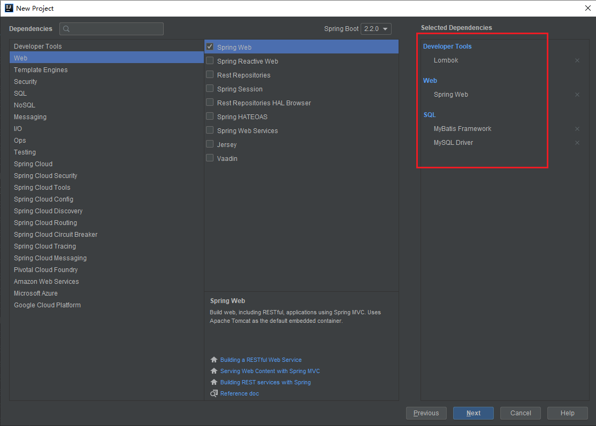
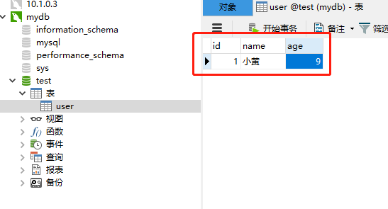
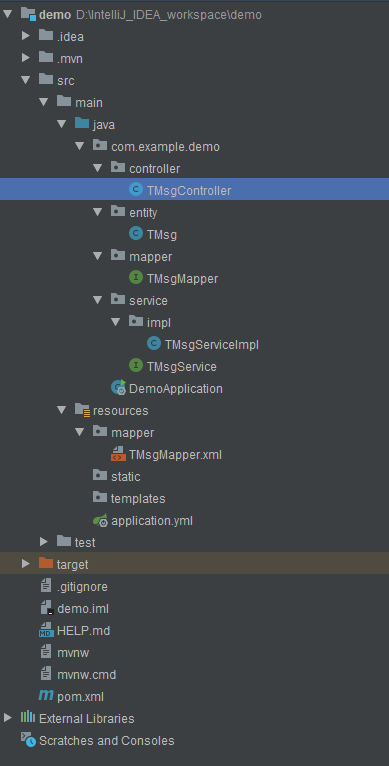
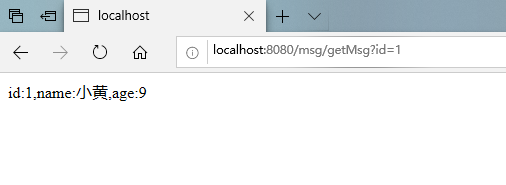

>本博客 [hjy-xh](https://hjy-xh.github.io/)，转载请申明出处

本教程的开发环境以工具：
+ JDK1.8
+ Navicat for MySQL（简单来说是一种数据库图形化工具，方便直接操作数据库）
+ IntelliJ IDEA

开始之前,先对我们要用到的东西有个大概的了解:

* Spring Boot 中分为为 controller层、service层、dao层、entity层。

entity层存放实体类,与数据库中的属性值基本保持一致,定义为私有,实现set和get方法。

service层存放业务逻辑处理,不直接和数据库打交道,该层有接口还有接口的实现方法，在接口的实现方法中需要导入mapper层,service是供我们使用的方法(提供controller层调用的方法)。

dao层即mapper层，对数据库进行持久化操作，该层的方法是针对数据库操作的，基本用到的就是增删改查。它只是个接口，只有方法名字，具体实现在mapper.xml中。

controller层即控制器，导入service层，因为service中的方法是我们使用到的，controller通过接收前端传过来的参数进行业务操作，再返回一个指定的路径或者数据表。

* MySQL就不用说了,最流行的关系型数据库管理系统。

* MyBatis首先Mybatis是一个优秀的持久化框架,它支持自定义SQL查询、存储过程,和很好的一个映射。第二,Mybatis减少了大部分JDBC的代码,避免了手动设置参数和结果集的映射。第三,Mybatis用简单的XML配置文件或注解来配置映射关系,将接口和POJO对象映射到数据库记录中。(看不懂也没关系,我也不太清楚,慢慢学!)


### 一.项目构建
##### 1.通过IDEA创建工程:打开IDEA->file->New->Project->Spring Initializr
##### 2.next之后添加如图依赖(红框部分)

##### 3.MySQL部分:打开Navicat,选择数据库,新建查询,DDL如下:
    CREATE TABLE `user` (
      `id` int(11) NOT NULL,
      `name` varchar(255),
      `age` int(11),
      PRIMARY KEY (`id`)
    )
##### 刷新表之后可以看到刚刚新建的表,继续新建查询,DDL如下:
    INSERT INTO t_msg (id, NAME, age)
    VALUES
    (1, '小黄', 9);
##### 刷新表之后可以看到刚刚插入的数据,如下图所示:

##### 4.构建项目目录,如图所示:

##### 构建数据库对应的实体类TMsg，这个类放在entity,代码如下:
```java
package com.example.demo.entity;

import lombok.Data;

import java.io.Serializable;

/**
 * Created by HJY on 2019/10/21.
 */
@Data
public class TMsg implements Serializable {

    private Integer id;

    private String name;

    private Integer age;

    public String getMessage(){
        return "id:"+id+",name:"+name+",age:"+age;
    }
}

```
##### 构建构建对应的Mapper接口,代码如下:
```java
package com.example.demo.mapper;

import com.example.demo.entity.TMsg;
import org.apache.ibatis.annotations.Mapper;

/**
 * Created by HJY on 2019/10/21.
 */
@Mapper
public interface TMsgMapper {

    public TMsg findById(Integer id);

}
```
##### Mapper接口与TMsgMapper.xml文件对应关系,代码如下:
```xml
<?xml version="1.0" encoding="UTF-8"?>
<!DOCTYPE mapper PUBLIC "-//mybatis.org//DTD Mapper 3.0//EN" "http://mybatis.org/dtd/mybatis-3-mapper.dtd">
<mapper namespace="com.example.demo.mapper.TMsgMapper">
    <select id="findById" resultType="com.example.demo.entity.TMsg">
        SELECT id,name,age from user WHERE id = #{id}
    </select>
</mapper>
```
##### service层接口与其实现,代码如下:
```java
package com.example.demo.service;

import com.example.demo.entity.TMsg;

/**
 * Created by HJY on 2019/10/21.
 */
public interface TMsgService {

    public TMsg findById(Integer id);

}
```
```java
package com.example.demo.service.impl;

import com.example.demo.entity.TMsg;
import com.example.demo.mapper.TMsgMapper;
import com.example.demo.service.TMsgService;
import org.springframework.beans.factory.annotation.Autowired;
import org.springframework.stereotype.Service;

/**
 * Created by HJY on 2019/10/21.
 */
@Service
public class TMsgServiceImpl implements TMsgService {

    @Autowired
    private TMsgMapper tMsgMapper;

    @Override
    public TMsg findById(Integer id) {
        return tMsgMapper.findById(id);
    }
}

```
##### 在controller层构建一个get方法，通过id获取信息,代码如下:
```java
package com.example.demo.controller;

import com.example.demo.entity.TMsg;
import com.example.demo.service.TMsgService;
import org.apache.ibatis.annotations.Param;
import org.springframework.beans.factory.annotation.Autowired;
import org.springframework.web.bind.annotation.GetMapping;
import org.springframework.web.bind.annotation.RequestMapping;
import org.springframework.web.bind.annotation.RestController;

/**
 * Created by HJY on 2019/10/21.
 */
@RestController
@RequestMapping("/msg")
public class TMsgController {

    @Autowired
    private TMsgService tMsgService;

    @GetMapping("/getMsg")
    public String getMsg(@Param("id") Integer id){
        TMsg tMsg = tMsgService.findById(id);
        return tMsg.getMessage();
    }

}
```
##### 修改application.properties文件后缀为application.yml,复制如下代码到该文件中,此处填写数据库信息,还有mybatis的数据库映射地址,实体类地址.(password如果是数字需要用单引号引起来):
```java
spring:
  datasource:
    url: jdbc:mysql://localhost:3306/test?useSSL=true&serverTimezone=Asia/Shanghai
    username: root
    password: '1234567'
    driver-class-name: com.mysql.cj.jdbc.Driver
mybatis:
  mapper-locations: classpath*:mapper/*Mapper.xml
  type-aliases-package: com.example.demo.entity
```


#### 二.项目运行
##### 启动项目,打开浏览器,输入http://localhost:8080/msg/getMsg?id=1

##### 此时可以看到我们在数据库中插入的数据,至此完成.
