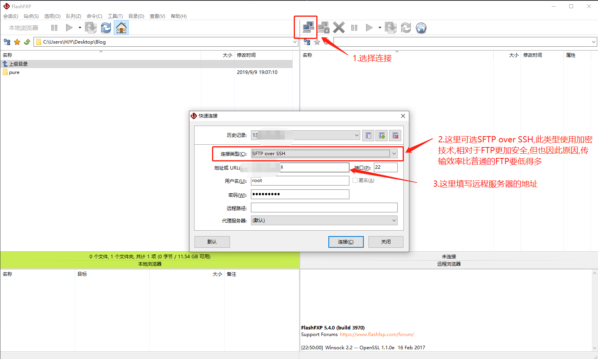
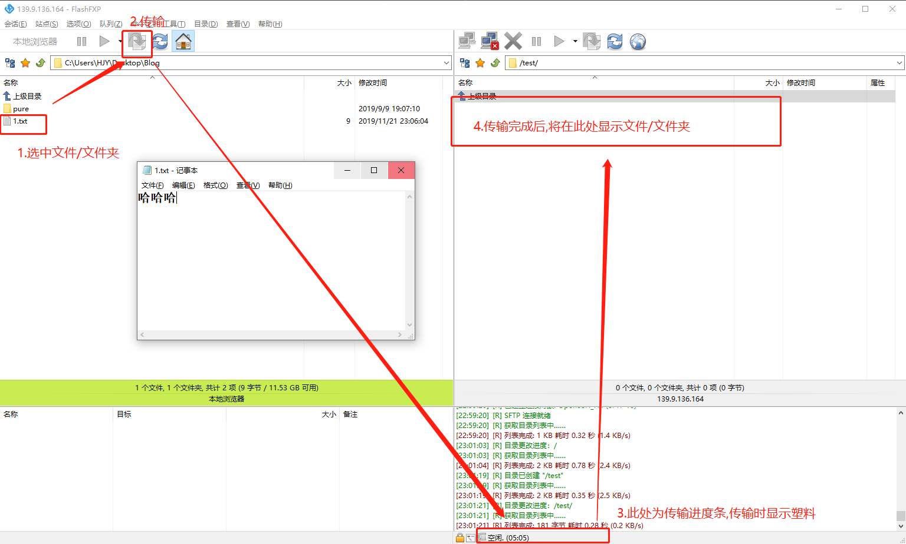
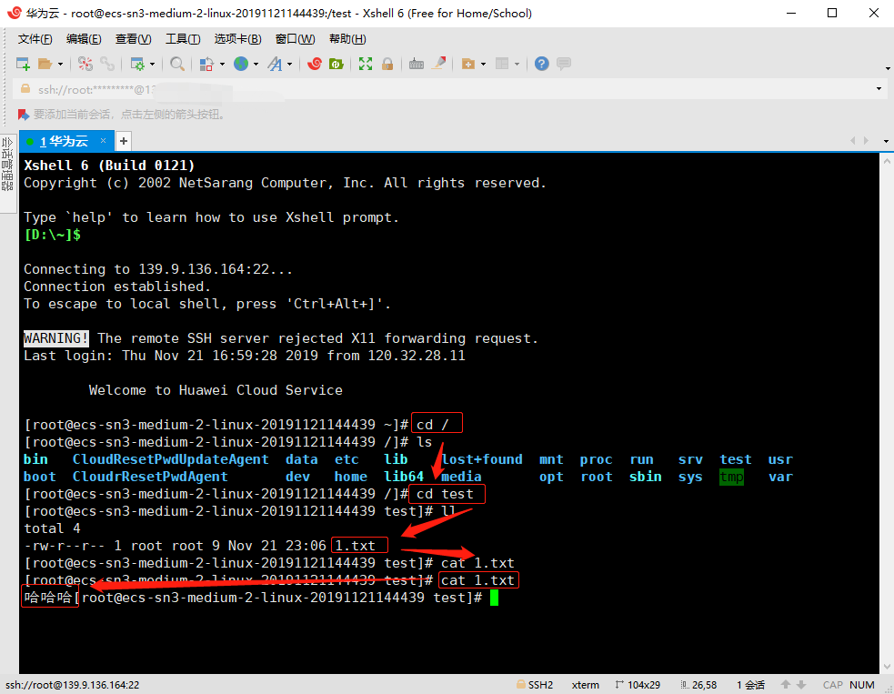

>本博客 [hjy-xh](https://hjy-xh.github.io/)，转载请申明出处

当我们在自己的电脑上完成开发工作后,常常需要把项目打包上传到远程服务器上部署,那如何进行操作呢?
本文提供一种相对简便的方法用以解决该问题.

**本文实践具体场景:本地上传文件至华为云服务器,用Xshell这个强大的安全终端模拟软件来验证是否成功**

###  通过FTP工具
FTP（File Transfer Protocol）是Internet上用来传送文件的协议（文件传输协议）.

现在有很多FTP工具 : FlashFXP、FileZilla、xFTP等等,操作都不复杂,这里用FlashFXP做演示

- 打开FlashFXP进行操作

- 打开Xshell验证是否上传成功

可以看到终端输出的"哈哈哈",说明文件上传成功.