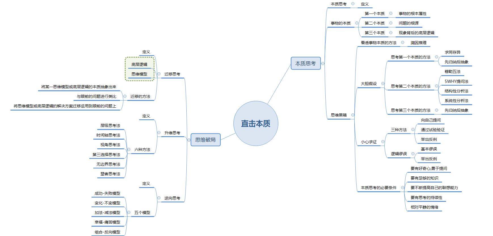

>本博客 [hjy-xh](https://hjy-xh.github.io/)，转载请申明出处

这本书让我受益很多，思维导图分享给大家。
以下再完善一些概念：
- 迁移思考：迁移思考是先找到经过抽象与当前问题“表面不同、本质相似”的问题，通过借用前面问题的解决方法，解决当下问题的思维方式。它的迁移对象主要是思维模型和底层逻辑。
- 升维思考：跳出眼前问题的限制和常规解法，通过层级、时间、视角、边界、位置、结构的变换，重新思考问题及其解决之道的思考方式。升维思考的本质是对价值观、人生观、世界观的重新审视，拓展及重塑。比如，层级思考法和时间轴思考法是对自我价值观的审视，视角思考法是对世界观的拓展和重塑，无边界思考法是对人生观的拓展和重塑。
-逆向思维：它是对司空见惯的、似乎已成定论的事物或观点反过来思考的一种思维方式。