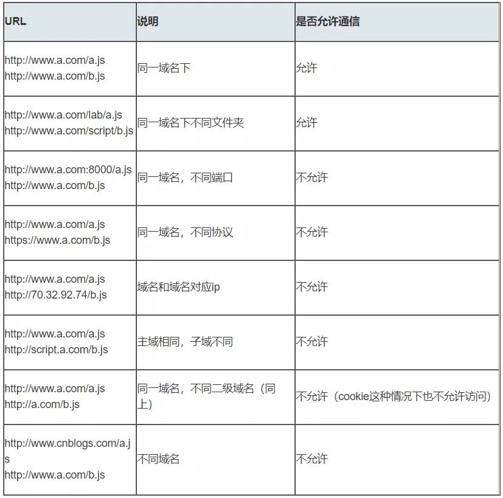
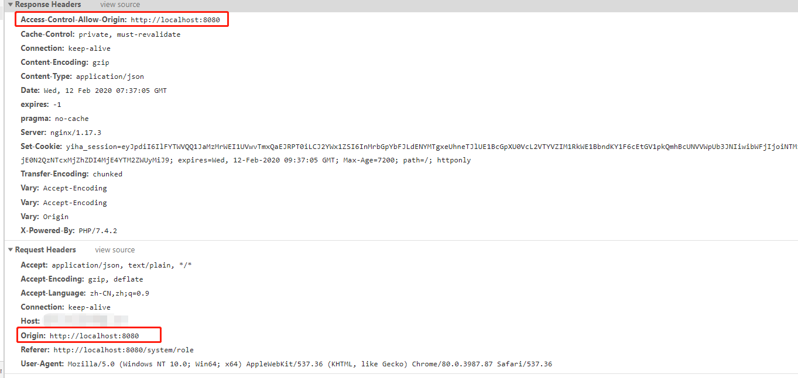

>本博客 [hjy-xh](https://hjy-xh.github.io/)，转载请申明出处

## 跨域问题的产生
前端开发人员都知道,浏览器安全的基石是"同源策略"（same-origin policy）.
同源策略是 1995 年由 Netscape 公司引入浏览器.目前所有浏览器都实行这个策略.它主要是为了防止XSS,CSRF攻击.

## 域名
URL的构成——http://主机名 . 域名（端口号、参数、查询等可选）

此外,我们还要知道域是分层管理的,像中国的行政级别:
最高层的域是根域(root)".",就是一个点,像国家主席一样.全球只有13个根域服务器,基本数都在美国,中国一台根域服务器都没有.

根域的下一层就是第二层次的顶级域(TLD),像各省的省长.它也就是俗称的"域名后缀",顶级域划分方法:
- 按国家划分: .cn(中国)、.tw(台湾)、.hk(香港)等
- 按组织性质划分: .org、.net、.com、.gov、.cc等
- 反向域: arpa(这是反向解析的特殊顶级域)

顶级域的下一层就是普通的域,公司或个人在互联网上注册的域名一般都是这些普通的域,如baidu.com.

**注意点:**
- 顶级域名就是一级域名
- N级域名就是在N-1级域名前追加一级


## 同源策略
这里的"同源"指的是:
- **协议相同**
- **域名相同**
- **端口相同**

带来的限制:
- **Cookie、LocalStorage 和 IndexDB 无法读取**
- **DOM无法获得**
- **AJAX请求不能发送**

但是有三个标签是允许跨域加载资源的:
- **&lt;img src=""&gt;**
- **&lt;link href=""&gt;**
- **&lt;script src=""&gt;**

## 常见的跨域场景
当协议、子域名、主域名、端口号任意一个不相同时,都是不同的域.
不同域之间相互请求资源,就称为"**跨域**",常见跨域场景如下所示:


**注意点:**
- 如果是协议和端口造成的跨域问题,"前台"是无能为力的
- 在跨域问题上,仅仅是通过"URL的首部"来识别而不会根据域名对应的IP地址是否相同来判断.

这里你或许有两个疑问:
- 在跨域的情况下,请求被怎么处理了?
	跨域并不是请求发不出去,请求能发出去,服务端能收到请求并正常响应,只是响应结果被浏览器拦截了.
	
- 为什么提交表单可以避免跨域问题,Ajax就不行?
	跨域的目的是为了组织用户读到另一个域名下的内容,Ajax可以获取响应,这里存在有安全隐患,故而浏览器拦截了响应;表单则只是提交数据,不会获取新的内容,所以可以发去跨域请求.

## 跨域解决方案
#### CORS跨域资源共享(Cross-Origin Resource Sharing)

CORS 需要浏览器和后端同时支持,实现 CORS 通信的关键是后端.目前几乎所有浏览器都支持 CORS, IE则不能低于IE10.
服务端设置 Access-Control-Allow-Origin 就可以开启 CORS. 该属性可以表示哪些域名可以访问资源,如果设置通配符则表示所有网站都可以访问资源.
虽然设置 CORS 和前端没什么关系,但是通过这种方式解决跨域问题的话,会在发送请求时出现两种情况,分别为简单请求和非简单请求(需预检请求).

**简单请求:**

使用下面任意HTTP方法的:
- GET
- HEAD
- POST

Content-Type 的值仅限于下列三者之一:
- text/plain
- multipart/form-data
- application/x-www-form-urlencoded

对于简单请求,浏览器会直接发送 CORS 请求,具体说来就是在 header 中加入 Origin 请求头字段.同样,在响应头中,返回服务器设置的相关 CORS 头部字段, Access-Control-Allow-Origin 字段为允许跨域请求的源.请求时浏览器在请求头的 Origin 中说明请求的源，服务器收到后发现允许该源跨域请求，则会成功返回,具体如下:

**非简单请求:**

使用下面任意HTTP方法的:
- PUT
- DELETE
- CONNECT
- OPTIONS
- TRACE
- PATCH

Content-Type 的值不属于下列三者之一:
- text/plain
- multipart/form-data
- application/x-www-form-urlencoded

当符合非简单请求(预检请求)的条件时,浏览器会自动先发送一个options请求,如果服务端支持该请求,则会将真正的请求发送到后端;反之,控制台将会抛出错误.

如果非简单请求(预检请求)发送成功，则会在头部多返回以下字段:
```
Access-Control-Allow-Origin: http://localhost:8000  //该字段表明可供那个源跨域
Access-Control-Allow-Methods: GET, POST, PUT        // 该字段表明服务端支持的请求方法
Access-Control-Allow-Headers: X-Custom-Header       // 实际请求将携带的自定义请求首部字段
```

####  JSONP
- 原理:利用**&lt;script&gt;**标签没有跨域限制的漏洞,网页可以得到从其它来源动态产生 JSON 数据.JSONP 请求必须要对方的服务器做支持才可以.
- JSONP和AJAX对比:二者都是客户端遵循向服务器发送请求,从服务器获取数据的方式.但AJAX属于同源策略,JSONP不是.

看个例子:
```
<!DOCTYPE HTML>
<html>
<head>
<mera http-equiv="Content-Type" content="text/html;charset=utf-8">
<title>JSONP</title>
</head>
<body>

</body>
</html>
```


